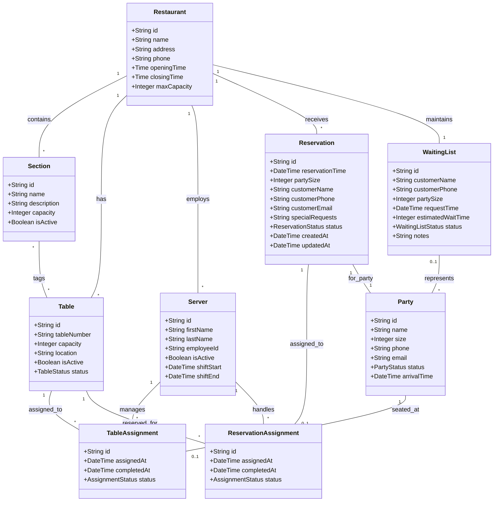

# Restaurant Seating System - Data Model

## Overview
This document defines the abstract data model for a restaurant seating system, focusing on the core entities and their relationships.

## UML Class Diagram

## Entity Descriptions

### Restaurant
Represents a restaurant establishment with basic information including name, address, contact details, operating hours, and maximum capacity.

### Section
Represents a logical grouping or area within the restaurant (e.g., "Patio", "Main Dining", "Bar Area"). Tables can belong to multiple sections, allowing for flexible categorization.

### Table
Represents a physical table in the restaurant with a unique identifier, capacity, location, and current status. Tables can be tagged with multiple sections.

### Party
Represents a group of customers dining together. Contains information about the party size, contact details, and current status (waiting, seated, etc.).

### Reservation
Represents a booked reservation with customer details, party size, reservation time, and special requests. Each reservation is associated with a party.

### WaitingList
Represents customers waiting for a table when the restaurant is at capacity. Contains customer information, party size, and estimated wait time.

### Server
Represents restaurant staff members who manage tables and handle reservations. Contains employee information and current shift details.

### TableAssignment
Represents the assignment of a table to a party for dining. Tracks when the assignment was made and completed.

### ReservationAssignment
Represents the assignment of a table to a reservation. Tracks the reservation fulfillment process.

## Key Design Decisions

1. **Section-Table Many-to-Many**: Tables can belong to multiple sections (e.g., a table could be both "Patio" and "Smoking Allowed")

2. **Separate Assignment Entities**: TableAssignment and ReservationAssignment track the actual seating process separately from the core entities

3. **Party as Central Entity**: Party serves as the central entity for customer groups, with both reservations and waiting list entries referencing it

4. **Status Enums**: Each entity includes status fields to track current state (e.g., TableStatus, PartyStatus, ReservationStatus)

5. **Flexible Relationships**: The model allows for various seating scenarios including walk-ins, reservations, and waiting list management
