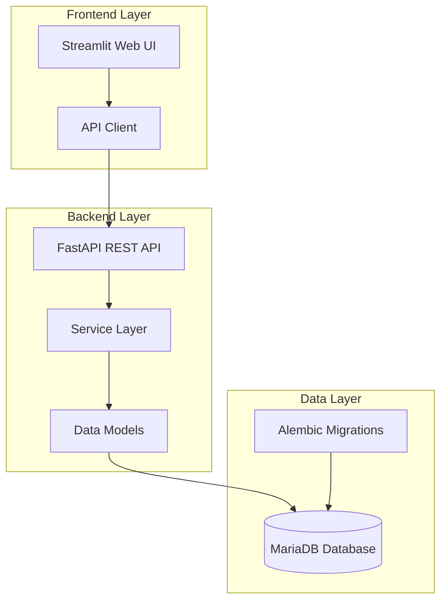
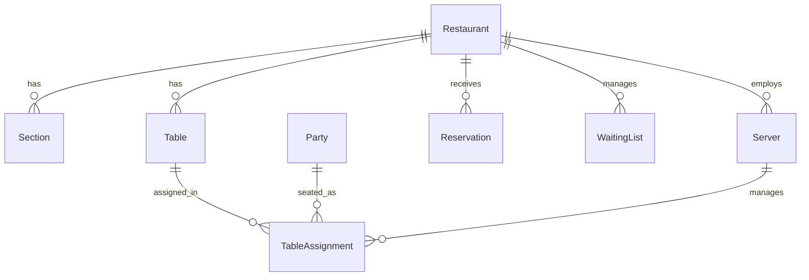

# Restaurant Seating System Documentation

Welcome to the comprehensive documentation for the Restaurant Seating System. This documentation is designed to help developers understand, develop, and maintain the system.

## 📚 Documentation Structure

### 🏗️ Architecture
- [System Overview](architecture/overview.md) - High-level system architecture and design
- [Data Model](architecture/data-model.md) - Database schema and entity relationships

### 🔌 API Documentation
- [API Overview](api/overview.md) - RESTful API introduction and endpoints
- [API Reference](api/api-reference.md) - Complete API endpoint documentation

### 🛠️ Development
- [Setup Guide](development/setup.md) - Development environment setup
- [Testing Guide](development/testing.md) - Testing strategies and best practices
- [Contributing Guide](development/contributing.md) - How to contribute to the project

### 🚀 Deployment
- [Deployment Overview](deployment/overview.md) - Production deployment guide

## 🚀 Quick Start

### Prerequisites
- Python 3.8+
- Docker and Docker Compose
- Git

### Installation

```bash
# Clone the repository
git clone <repository-url>
cd restaurant-seating-system

# Copy environment file
cp env.example .env

# Start with Docker
make dev
```

### Access the Application
- **API Documentation**: http://localhost:8000/docs
- **Frontend**: http://localhost:8501
- **Database**: localhost:3306

## 🏗️ System Architecture

The Restaurant Seating System is built with a modern, scalable architecture:



## 🔧 Technology Stack

### Backend
- **FastAPI** - Modern, fast web framework
- **SQLAlchemy** - SQL toolkit and ORM
- **Pydantic** - Data validation
- **MariaDB** - Relational database
- **Alembic** - Database migrations

### Frontend
- **Streamlit** - Rapid web application development
- **Python** - Programming language

### Infrastructure
- **Docker** - Containerization
- **Docker Compose** - Multi-container orchestration

## 📊 Key Features

- **Restaurant Management** - Complete CRUD operations
- **Table Management** - Flexible table configuration
- **Reservation System** - Advanced booking management
- **Waiting List** - Queue management for walk-ins
- **Real-time Analytics** - Occupancy tracking
- **Staff Management** - Server assignment and tracking

## 🗄️ Database Schema

The system uses a relational database with the following core entities:



## 🔌 API Endpoints

The system provides RESTful APIs for all operations:

- **Restaurants** - `/api/v1/restaurants`
- **Parties** - `/api/v1/parties`
- **Reservations** - `/api/v1/reservations`
- **Waiting List** - `/api/v1/waiting-list`
- **Servers** - `/api/v1/servers`
- **Assignments** - `/api/v1/assignments`

## 🧪 Testing

The system includes comprehensive testing:

```bash
# Run all tests
pytest

# Run with coverage
pytest --cov=backend tests/

# Run specific test file
pytest tests/test_api.py
```

## 🚀 Deployment

### Development
```bash
make dev
```

### Production
```bash
docker-compose -f docker-compose.prod.yml up -d
```

## 📖 Getting Help

### For Developers
1. Check the [Development Setup](development/setup.md) guide
2. Review the [API Documentation](api/overview.md)
3. Look at the [Testing Guide](development/testing.md)

### For Contributors
1. Read the [Contributing Guide](development/contributing.md)
2. Check existing issues and discussions
3. Follow the code style guidelines

### For Deployers
1. Review the [Deployment Guide](deployment/overview.md)
2. Check the [Architecture Overview](architecture/overview.md)
3. Follow security best practices

## 🔄 Development Workflow

1. **Fork and Clone** - Fork the repository and clone locally
2. **Create Branch** - Create a feature branch
3. **Develop** - Make your changes following the coding standards
4. **Test** - Run tests and ensure they pass
5. **Document** - Update documentation if needed
6. **Submit PR** - Create a pull request for review

## 📝 Code Standards

- **Python**: Follow PEP 8 style guidelines
- **API**: Use RESTful design principles
- **Database**: Follow normalization rules
- **Testing**: Write comprehensive tests
- **Documentation**: Keep documentation up to date

## 🛡️ Security

- Input validation using Pydantic
- SQL injection prevention with SQLAlchemy ORM
- CORS configuration for cross-origin requests
- Comprehensive error handling

## 📈 Performance

- Database connection pooling
- Efficient query optimization
- Caching strategies
- Horizontal scaling support

## 🔍 Monitoring

- Health check endpoints
- Structured logging
- Error tracking
- Performance monitoring

## 📚 Additional Resources

- [FastAPI Documentation](https://fastapi.tiangolo.com/)
- [SQLAlchemy Documentation](https://docs.sqlalchemy.org/)
- [Streamlit Documentation](https://docs.streamlit.io/)
- [Docker Documentation](https://docs.docker.com/)

## 🤝 Contributing

We welcome contributions! Please see our [Contributing Guide](development/contributing.md) for details.

## 📄 License

This project is licensed under the MIT License - see the LICENSE file for details.

## 🆘 Support

If you need help or have questions:

1. Check the documentation
2. Search existing issues
3. Create a new issue
4. Contact the maintainers

---

**Happy coding! 🍽️**
