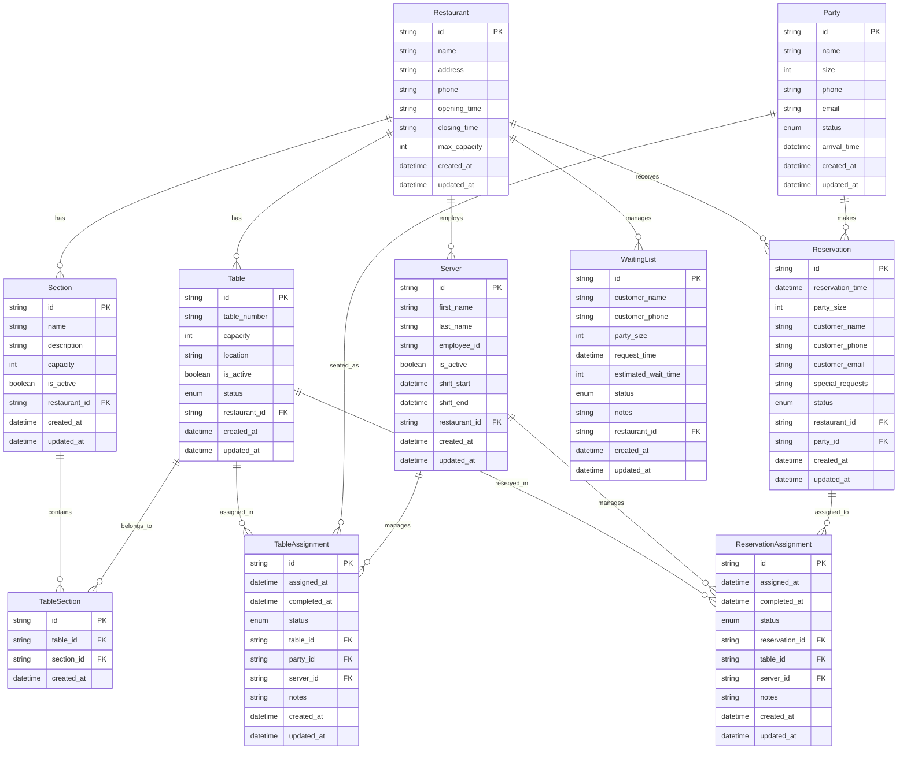

# Data Model Documentation

## Overview

The Restaurant Seating System uses a relational database model designed to handle complex restaurant operations. The data model is implemented using SQLAlchemy ORM with MariaDB as the underlying database.

## Entity Relationship Diagram

## Core Entities

### Restaurant
The central entity representing a restaurant establishment.

**Key Attributes:**
- `id`: Unique identifier (UUID)
- `name`: Restaurant name
- `address`: Physical address
- `phone`: Contact phone number
- `opening_time`/`closing_time`: Operating hours
- `max_capacity`: Maximum total seating capacity

**Relationships:**
- One-to-many with Sections, Tables, Servers, Reservations, WaitingList

### Section
Represents different areas within a restaurant (e.g., "Main Dining", "Patio").

**Key Attributes:**
- `id`: Unique identifier (UUID)
- `name`: Section name
- `description`: Optional description
- `capacity`: Maximum capacity for the section
- `is_active`: Whether the section is currently operational

**Relationships:**
- Many-to-one with Restaurant
- Many-to-many with Tables (through TableSection)

### Table
Individual dining tables within the restaurant.

**Key Attributes:**
- `id`: Unique identifier (UUID)
- `table_number`: Human-readable table identifier
- `capacity`: Maximum seating capacity
- `location`: Physical location description
- `is_active`: Whether the table is operational
- `status`: Current table status (AVAILABLE, OCCUPIED, RESERVED, etc.)

**Relationships:**
- Many-to-one with Restaurant
- Many-to-many with Sections (through TableSection)
- One-to-many with TableAssignments and ReservationAssignments

### Party
Represents a group of customers dining together.

**Key Attributes:**
- `id`: Unique identifier (UUID)
- `name`: Party name (e.g., "Smith Party")
- `size`: Number of people in the party
- `phone`/`email`: Contact information
- `status`: Current party status (WAITING, SEATED, FINISHED, etc.)
- `arrival_time`: When the party arrived

**Relationships:**
- One-to-many with TableAssignments
- One-to-many with Reservations

### Reservation
Pre-booked dining reservations.

**Key Attributes:**
- `id`: Unique identifier (UUID)
- `reservation_time`: Scheduled dining time
- `party_size`: Number of people
- `customer_name`/`customer_phone`/`customer_email`: Customer details
- `special_requests`: Any special requirements
- `status`: Reservation status (CONFIRMED, PENDING, CANCELLED, etc.)

**Relationships:**
- Many-to-one with Restaurant
- Many-to-one with Party (optional)
- One-to-many with ReservationAssignments

### WaitingList
Walk-in customers waiting for tables.

**Key Attributes:**
- `id`: Unique identifier (UUID)
- `customer_name`/`customer_phone`: Customer details
- `party_size`: Number of people
- `request_time`: When they joined the waiting list
- `estimated_wait_time`: Predicted wait time in minutes
- `status`: Waiting list status (WAITING, SEATED, CANCELLED, etc.)
- `notes`: Additional information

**Relationships:**
- Many-to-one with Restaurant

### Server
Restaurant staff members.

**Key Attributes:**
- `id`: Unique identifier (UUID)
- `first_name`/`last_name`: Server name
- `employee_id`: Unique employee identifier
- `is_active`: Whether the server is currently working
- `shift_start`/`shift_end`: Current shift times

**Relationships:**
- Many-to-one with Restaurant
- One-to-many with TableAssignments and ReservationAssignments

## Assignment Entities

### TableAssignment
Links parties to tables with server assignments.

**Key Attributes:**
- `id`: Unique identifier (UUID)
- `assigned_at`: When the assignment was made
- `completed_at`: When the assignment ended
- `status`: Assignment status (ACTIVE, COMPLETED, CANCELLED)
- `notes`: Additional assignment notes

**Relationships:**
- Many-to-one with Table, Party, Server

### ReservationAssignment
Links reservations to tables with server assignments.

**Key Attributes:**
- `id`: Unique identifier (UUID)
- `assigned_at`: When the assignment was made
- `completed_at`: When the assignment ended
- `status`: Assignment status (ACTIVE, COMPLETED, CANCELLED)
- `notes`: Additional assignment notes

**Relationships:**
- Many-to-one with Reservation, Table, Server

## Enums and Status Values

### TableStatus
- `AVAILABLE`: Table is free and ready for seating
- `OCCUPIED`: Table is currently in use
- `RESERVED`: Table is reserved for a specific time
- `OUT_OF_ORDER`: Table is not available due to maintenance
- `CLEANING`: Table is being cleaned after use

### PartyStatus
- `WAITING`: Party is waiting for a table
- `SEATED`: Party has been seated at a table
- `FINISHED`: Party has finished dining
- `CANCELLED`: Party cancelled their visit

### ReservationStatus
- `CONFIRMED`: Reservation is confirmed
- `PENDING`: Reservation is pending confirmation
- `CANCELLED`: Reservation was cancelled
- `COMPLETED`: Reservation was completed
- `NO_SHOW`: Customer didn't show up

### WaitingListStatus
- `WAITING`: Customer is waiting for a table
- `SEATED`: Customer has been seated
- `CANCELLED`: Customer cancelled their wait
- `EXPIRED`: Wait time expired

### AssignmentStatus
- `ACTIVE`: Assignment is currently active
- `COMPLETED`: Assignment has been completed
- `CANCELLED`: Assignment was cancelled

## Data Integrity Rules

### Business Rules
1. **Table Capacity**: Party size cannot exceed table capacity
2. **Active Assignments**: Only one active assignment per table at a time
3. **Server Availability**: Servers must be active to receive assignments
4. **Reservation Timing**: Reservations must be for future times
5. **Party Status**: Parties must be in WAITING status to be assigned tables

### Database Constraints
1. **Primary Keys**: All entities have UUID primary keys
2. **Foreign Keys**: All foreign key relationships are enforced
3. **Unique Constraints**: Employee IDs and table numbers must be unique
4. **Check Constraints**: Status enums are validated at database level
5. **Not Null**: Required fields are marked as NOT NULL

## Indexing Strategy

### Primary Indexes
- All primary keys are automatically indexed
- Foreign key columns are indexed for join performance

### Secondary Indexes
- `restaurant_id` on all restaurant-related tables
- `status` columns for filtering operations
- `reservation_time` for time-based queries
- `arrival_time` for party management
- `request_time` for waiting list ordering

## Data Migration

The system uses Alembic for database migrations:

- **Version Control**: All schema changes are versioned
- **Rollback Support**: Migrations can be rolled back
- **Data Preservation**: Migrations preserve existing data
- **Environment Consistency**: Same schema across all environments

## Performance Considerations

### Query Optimization
- **Eager Loading**: Related entities loaded efficiently
- **Lazy Loading**: Large datasets loaded on demand
- **Connection Pooling**: Database connections are pooled
- **Query Caching**: Frequently used queries are cached

### Scalability
- **Horizontal Partitioning**: Tables can be partitioned by restaurant
- **Read Replicas**: Read operations can use replicas
- **Connection Limits**: Database connection limits are configured
- **Query Timeouts**: Long-running queries have timeouts

## Security Considerations

### Data Protection
- **Input Validation**: All inputs are validated using Pydantic
- **SQL Injection Prevention**: SQLAlchemy ORM prevents SQL injection
- **Data Encryption**: Sensitive data can be encrypted at rest
- **Access Control**: Database access is controlled through application logic

### Audit Trail
- **Created/Updated Timestamps**: All entities track modification times
- **Soft Deletes**: Important data is soft-deleted rather than hard-deleted
- **Change Logging**: Critical changes can be logged for audit purposes

## Next Steps

- [API Documentation](api/overview.md)
- [Database Setup](development/database-setup.md)
- [Migration Guide](development/migrations.md)
