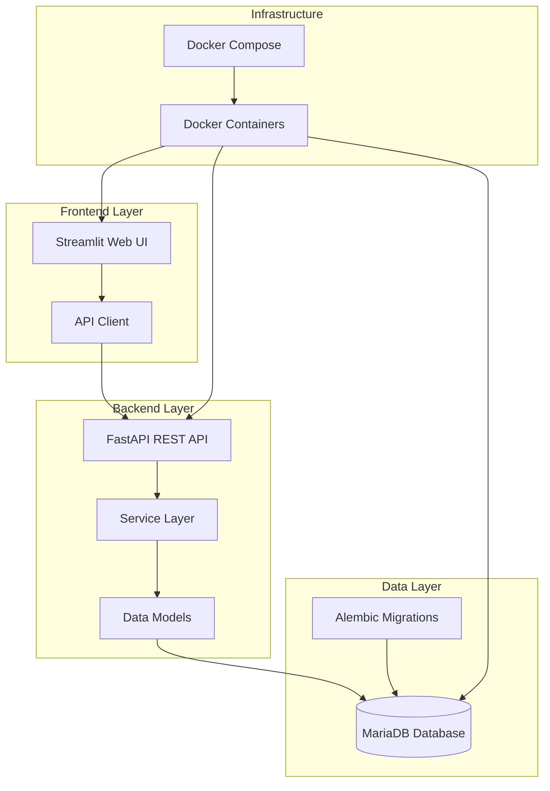
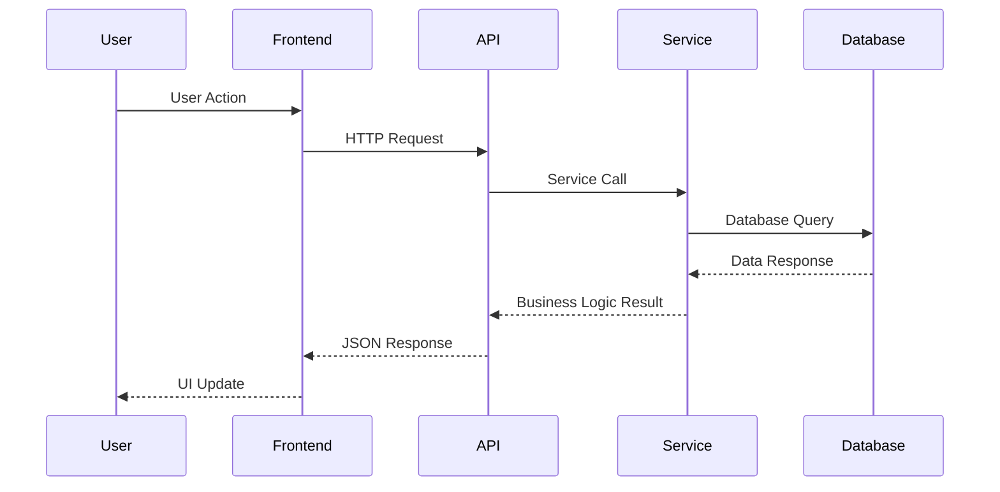

# System Architecture Overview

## Introduction

The Restaurant Seating System is a comprehensive full-stack application designed to manage restaurant operations including seating, reservations, table assignments, and customer flow. The system is built with modern technologies and follows clean architecture principles.

## High-Level Architecture

## Technology Stack

### Backend
- **FastAPI**: Modern, fast web framework for building APIs
- **SQLAlchemy**: SQL toolkit and Object-Relational Mapping (ORM)
- **Pydantic**: Data validation and settings management
- **MariaDB**: Relational database management system
- **Alembic**: Database migration tool
- **Uvicorn**: ASGI server for running FastAPI

### Frontend
- **Streamlit**: Rapid web application development framework
- **Python**: Programming language for both frontend and backend

### Infrastructure
- **Docker**: Containerization platform
- **Docker Compose**: Multi-container orchestration
- **Make**: Build automation tool

## System Components

### 1. API Layer (`backend/app/api/`)
The API layer provides RESTful endpoints for all system operations:

- **Restaurants API** (`restaurants.py`): Restaurant management
- **Parties API** (`parties.py`): Customer party management
- **Reservations API** (`reservations.py`): Reservation system
- **Waiting List API** (`waiting_list.py`): Walk-in customer management
- **Servers API** (`servers.py`): Staff management
- **Assignments API** (`assignments.py`): Table and reservation assignments

### 2. Service Layer (`backend/app/services/`)
Business logic implementation:

- **RestaurantService**: Restaurant operations and analytics
- **PartyService**: Party management
- **ReservationService**: Reservation handling
- **WaitingListService**: Waiting list management
- **ServerService**: Server operations
- **AssignmentService**: Table and reservation assignments

### 3. Data Layer (`backend/app/models/`)
Data models and schemas:

- **Database Models** (`database.py`): SQLAlchemy ORM models
- **API Schemas** (`schemas.py`): Pydantic models for request/response validation

### 4. Frontend Layer (`frontend/`)
User interface components:

- **Main App** (`streamlit_app.py`): Application entry point
- **API Client** (`api_client.py`): Backend communication
- **Page Modules** (`pages/`): Individual functionality pages

## Data Flow

## Key Design Patterns

### 1. Layered Architecture
- **Presentation Layer**: Streamlit frontend
- **API Layer**: FastAPI endpoints
- **Business Logic Layer**: Service classes
- **Data Access Layer**: SQLAlchemy models

### 2. Dependency Injection
- Database sessions injected into services
- Services injected into API endpoints
- Configuration injected throughout the application

### 3. Repository Pattern
- Service classes act as repositories
- Encapsulate data access logic
- Provide clean interface for business operations

### 4. DTO Pattern
- Pydantic schemas for data transfer
- Separate models for create, update, and response
- Validation at API boundaries

## Security Considerations

- **Input Validation**: Pydantic models validate all inputs
- **SQL Injection Prevention**: SQLAlchemy ORM prevents SQL injection
- **CORS Configuration**: Configurable cross-origin resource sharing
- **Error Handling**: Comprehensive error handling and logging

## Scalability Considerations

- **Database Connection Pooling**: SQLAlchemy connection pooling
- **Stateless API**: RESTful API design for horizontal scaling
- **Containerization**: Docker enables easy deployment scaling
- **Modular Design**: Clean separation of concerns for maintainability

## Monitoring and Logging

- **Structured Logging**: Python logging with configurable levels
- **Health Checks**: Built-in health check endpoints
- **Error Tracking**: Comprehensive exception handling
- **Performance Monitoring**: Database query optimization

## Next Steps

- [API Documentation](api/overview.md)
- [Database Schema](database/schema.md)
- [Development Setup](development/setup.md)
- [Deployment Guide](deployment/overview.md)
