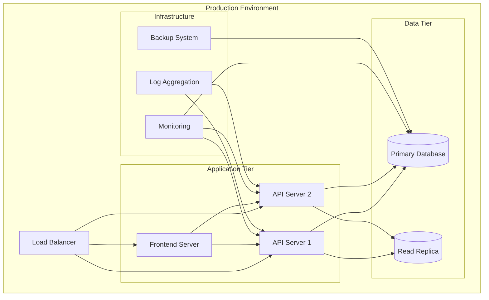

# Deployment Guide

## Overview

This guide covers deploying the Restaurant Seating System to various environments, from development to production. The system is designed to be containerized and can be deployed using Docker and Docker Compose.

## Deployment Architecture



## Prerequisites

### System Requirements

- **CPU**: 2+ cores
- **RAM**: 4GB+ (8GB recommended for production)
- **Storage**: 20GB+ available space
- **Network**: Stable internet connection

### Software Requirements

- **Docker**: 20.10+
- **Docker Compose**: 2.0+
- **Make**: For using Makefile commands (optional)

## Environment Configuration

### 1. Environment Variables

Create environment-specific configuration files:

#### Development (`.env.dev`)
```bash
# Application
APP_NAME=Restaurant Seating System API
APP_VERSION=1.0.0
DEBUG=true
HOST=0.0.0.0
PORT=8000

# Database
DATABASE_HOST=mariadb
DATABASE_PORT=3306
DATABASE_NAME=restaurant_seating_dev
DATABASE_USER=restaurant_user
DATABASE_PASSWORD=dev_password
DATABASE_ECHO=false

# Security
SECRET_KEY=dev-secret-key-change-in-production
ALGORITHM=HS256
ACCESS_TOKEN_EXPIRE_MINUTES=30

# CORS
ALLOWED_ORIGINS=["http://localhost:8501", "http://localhost:3000"]

# Logging
LOG_LEVEL=DEBUG
```

#### Production (`.env.prod`)
```bash
# Application
APP_NAME=Restaurant Seating System API
APP_VERSION=1.0.0
DEBUG=false
HOST=0.0.0.0
PORT=8000

# Database
DATABASE_HOST=production-db-host
DATABASE_PORT=3306
DATABASE_NAME=restaurant_seating_prod
DATABASE_USER=restaurant_user
DATABASE_PASSWORD=secure_production_password
DATABASE_ECHO=false

# Security
SECRET_KEY=your-very-secure-secret-key-here
ALGORITHM=HS256
ACCESS_TOKEN_EXPIRE_MINUTES=30

# CORS
ALLOWED_ORIGINS=["https://yourdomain.com", "https://api.yourdomain.com"]

# Logging
LOG_LEVEL=INFO
```

### 2. Docker Compose Configuration

#### Development (`docker-compose.dev.yml`)
```yaml
version: '3.8'

services:
  mariadb:
    image: mariadb:10.6
    container_name: restaurant-mariadb-dev
    environment:
      MYSQL_ROOT_PASSWORD: root_password
      MYSQL_DATABASE: restaurant_seating_dev
      MYSQL_USER: restaurant_user
      MYSQL_PASSWORD: dev_password
    ports:
      - "3306:3306"
    volumes:
      - mariadb_data_dev:/var/lib/mysql
      - ./scripts/init.sql:/docker-entrypoint-initdb.d/init.sql
    networks:
      - restaurant_network

  api:
    build:
      context: .
      dockerfile: Dockerfile
      target: development
    container_name: restaurant-api-dev
    environment:
      - DATABASE_HOST=mariadb
      - DATABASE_NAME=restaurant_seating_dev
      - DATABASE_USER=restaurant_user
      - DATABASE_PASSWORD=dev_password
      - DEBUG=true
    ports:
      - "8000:8000"
    volumes:
      - ./backend:/app/backend
      - ./requirements.txt:/app/requirements.txt
    depends_on:
      - mariadb
    networks:
      - restaurant_network
    command: uvicorn backend.main:app --host 0.0.0.0 --port 8000 --reload

  frontend:
    build:
      context: .
      dockerfile: Dockerfile
      target: frontend
    container_name: restaurant-frontend-dev
    environment:
      - API_BASE_URL=http://api:8000
    ports:
      - "8501:8501"
    volumes:
      - ./frontend:/app/frontend
      - ./requirements-frontend.txt:/app/requirements-frontend.txt
    depends_on:
      - api
    networks:
      - restaurant_network
    command: streamlit run frontend/streamlit_app.py --server.address 0.0.0.0 --server.port 8501

volumes:
  mariadb_data_dev:

networks:
  restaurant_network:
    driver: bridge
```

#### Production (`docker-compose.prod.yml`)
```yaml
version: '3.8'

services:
  mariadb:
    image: mariadb:10.6
    container_name: restaurant-mariadb-prod
    environment:
      MYSQL_ROOT_PASSWORD: ${MYSQL_ROOT_PASSWORD}
      MYSQL_DATABASE: ${DATABASE_NAME}
      MYSQL_USER: ${DATABASE_USER}
      MYSQL_PASSWORD: ${DATABASE_PASSWORD}
    volumes:
      - mariadb_data_prod:/var/lib/mysql
      - ./scripts/init.sql:/docker-entrypoint-initdb.d/init.sql
      - ./backup:/backup
    networks:
      - restaurant_network
    restart: unless-stopped
    command: --innodb-buffer-pool-size=1G --innodb-log-file-size=256M

  api:
    build:
      context: .
      dockerfile: Dockerfile
      target: production
    container_name: restaurant-api-prod
    environment:
      - DATABASE_HOST=mariadb
      - DATABASE_NAME=${DATABASE_NAME}
      - DATABASE_USER=${DATABASE_USER}
      - DATABASE_PASSWORD=${DATABASE_PASSWORD}
      - DEBUG=false
      - SECRET_KEY=${SECRET_KEY}
    ports:
      - "8000:8000"
    depends_on:
      - mariadb
    networks:
      - restaurant_network
    restart: unless-stopped
    command: gunicorn backend.main:app -w 4 -k uvicorn.workers.UvicornWorker --bind 0.0.0.0:8000

  frontend:
    build:
      context: .
      dockerfile: Dockerfile
      target: frontend
    container_name: restaurant-frontend-prod
    environment:
      - API_BASE_URL=http://api:8000
    ports:
      - "8501:8501"
    depends_on:
      - api
    networks:
      - restaurant_network
    restart: unless-stopped

  nginx:
    image: nginx:alpine
    container_name: restaurant-nginx-prod
    ports:
      - "80:80"
      - "443:443"
    volumes:
      - ./nginx.conf:/etc/nginx/nginx.conf
      - ./ssl:/etc/nginx/ssl
    depends_on:
      - api
      - frontend
    networks:
      - restaurant_network
    restart: unless-stopped

volumes:
  mariadb_data_prod:

networks:
  restaurant_network:
    driver: bridge
```

## Deployment Methods

### 1. Docker Compose Deployment

#### Development Deployment

```bash
# Clone repository
git clone <repository-url>
cd restaurant-seating-system

# Copy environment file
cp env.example .env.dev

# Edit environment variables
nano .env.dev

# Start development environment
docker-compose -f docker-compose.dev.yml up -d

# Check logs
docker-compose -f docker-compose.dev.yml logs -f

# Stop environment
docker-compose -f docker-compose.dev.yml down
```

#### Production Deployment

```bash
# Copy production environment file
cp env.example .env.prod

# Edit production environment variables
nano .env.prod

# Build and start production environment
docker-compose -f docker-compose.prod.yml up -d --build

# Check status
docker-compose -f docker-compose.prod.yml ps

# View logs
docker-compose -f docker-compose.prod.yml logs -f

# Stop environment
docker-compose -f docker-compose.prod.yml down
```

### 2. Manual Docker Deployment

#### Build Images

```bash
# Build API image
docker build -t restaurant-api:latest --target production .

# Build frontend image
docker build -t restaurant-frontend:latest --target frontend .

# Build development image
docker build -t restaurant-api:dev --target development .
```

#### Run Containers

```bash
# Start database
docker run -d \
  --name restaurant-mariadb \
  -e MYSQL_ROOT_PASSWORD=root_password \
  -e MYSQL_DATABASE=restaurant_seating \
  -e MYSQL_USER=restaurant_user \
  -e MYSQL_PASSWORD=restaurant_password \
  -p 3306:3306 \
  mariadb:10.6

# Start API
docker run -d \
  --name restaurant-api \
  --link restaurant-mariadb:mariadb \
  -e DATABASE_HOST=mariadb \
  -e DATABASE_NAME=restaurant_seating \
  -e DATABASE_USER=restaurant_user \
  -e DATABASE_PASSWORD=restaurant_password \
  -p 8000:8000 \
  restaurant-api:latest

# Start frontend
docker run -d \
  --name restaurant-frontend \
  --link restaurant-api:api \
  -e API_BASE_URL=http://api:8000 \
  -p 8501:8501 \
  restaurant-frontend:latest
```

### 3. Cloud Deployment

#### AWS ECS Deployment

```yaml
# ecs-task-definition.json
{
  "family": "restaurant-seating",
  "networkMode": "awsvpc",
  "requiresCompatibilities": ["FARGATE"],
  "cpu": "1024",
  "memory": "2048",
  "executionRoleArn": "arn:aws:iam::account:role/ecsTaskExecutionRole",
  "containerDefinitions": [
    {
      "name": "api",
      "image": "your-account.dkr.ecr.region.amazonaws.com/restaurant-api:latest",
      "portMappings": [
        {
          "containerPort": 8000,
          "protocol": "tcp"
        }
      ],
      "environment": [
        {
          "name": "DATABASE_HOST",
          "value": "your-rds-endpoint"
        }
      ],
      "logConfiguration": {
        "logDriver": "awslogs",
        "options": {
          "awslogs-group": "/ecs/restaurant-seating",
          "awslogs-region": "us-west-2",
          "awslogs-stream-prefix": "ecs"
        }
      }
    }
  ]
}
```

#### Google Cloud Run Deployment

```yaml
# cloudbuild.yaml
steps:
  - name: 'gcr.io/cloud-builders/docker'
    args: ['build', '-t', 'gcr.io/$PROJECT_ID/restaurant-api', '.']
  - name: 'gcr.io/cloud-builders/docker'
    args: ['push', 'gcr.io/$PROJECT_ID/restaurant-api']
  - name: 'gcr.io/cloud-builders/gcloud'
    args: ['run', 'deploy', 'restaurant-api', '--image', 'gcr.io/$PROJECT_ID/restaurant-api', '--region', 'us-central1']
```

## Database Setup

### 1. Initial Database Setup

```bash
# Run database migrations
docker-compose exec api alembic upgrade head

# Or manually
docker-compose exec api python -c "from backend.app.database.connection import create_tables; create_tables()"
```

### 2. Database Backup

```bash
# Create backup
docker-compose exec mariadb mysqldump -u root -p restaurant_seating > backup_$(date +%Y%m%d_%H%M%S).sql

# Restore backup
docker-compose exec -T mariadb mysql -u root -p restaurant_seating < backup_file.sql
```

### 3. Database Monitoring

```sql
-- Check database status
SHOW STATUS;

-- Check table sizes
SELECT 
    table_name,
    ROUND(((data_length + index_length) / 1024 / 1024), 2) AS 'Size (MB)'
FROM information_schema.tables
WHERE table_schema = 'restaurant_seating'
ORDER BY (data_length + index_length) DESC;

-- Check slow queries
SHOW VARIABLES LIKE 'slow_query_log';
SHOW VARIABLES LIKE 'long_query_time';
```

## Load Balancing and Scaling

### 1. Nginx Configuration

```nginx
# nginx.conf
upstream api_backend {
    server api1:8000;
    server api2:8000;
    server api3:8000;
}

upstream frontend_backend {
    server frontend1:8501;
    server frontend2:8501;
}

server {
    listen 80;
    server_name yourdomain.com;

    location /api/ {
        proxy_pass http://api_backend;
        proxy_set_header Host $host;
        proxy_set_header X-Real-IP $remote_addr;
        proxy_set_header X-Forwarded-For $proxy_add_x_forwarded_for;
        proxy_set_header X-Forwarded-Proto $scheme;
    }

    location / {
        proxy_pass http://frontend_backend;
        proxy_set_header Host $host;
        proxy_set_header X-Real-IP $remote_addr;
        proxy_set_header X-Forwarded-For $proxy_add_x_forwarded_for;
        proxy_set_header X-Forwarded-Proto $scheme;
    }
}
```

### 2. Horizontal Scaling

```bash
# Scale API services
docker-compose up -d --scale api=3

# Scale frontend services
docker-compose up -d --scale frontend=2
```

## Monitoring and Logging

### 1. Application Monitoring

```yaml
# docker-compose.monitoring.yml
version: '3.8'

services:
  prometheus:
    image: prom/prometheus
    ports:
      - "9090:9090"
    volumes:
      - ./prometheus.yml:/etc/prometheus/prometheus.yml
    networks:
      - restaurant_network

  grafana:
    image: grafana/grafana
    ports:
      - "3000:3000"
    environment:
      - GF_SECURITY_ADMIN_PASSWORD=admin
    volumes:
      - grafana_data:/var/lib/grafana
    networks:
      - restaurant_network

  elasticsearch:
    image: elasticsearch:7.14.0
    environment:
      - discovery.type=single-node
    volumes:
      - elasticsearch_data:/usr/share/elasticsearch/data
    networks:
      - restaurant_network

  kibana:
    image: kibana:7.14.0
    ports:
      - "5601:5601"
    environment:
      - ELASTICSEARCH_HOSTS=http://elasticsearch:9200
    depends_on:
      - elasticsearch
    networks:
      - restaurant_network

volumes:
  grafana_data:
  elasticsearch_data:

networks:
  restaurant_network:
    external: true
```

### 2. Log Aggregation

```yaml
# docker-compose.logging.yml
version: '3.8'

services:
  filebeat:
    image: elastic/filebeat:7.14.0
    volumes:
      - ./filebeat.yml:/usr/share/filebeat/filebeat.yml
      - /var/lib/docker/containers:/var/lib/docker/containers:ro
      - /var/run/docker.sock:/var/run/docker.sock:ro
    networks:
      - restaurant_network

  logstash:
    image: elastic/logstash:7.14.0
    volumes:
      - ./logstash.conf:/usr/share/logstash/pipeline/logstash.conf
    networks:
      - restaurant_network
```

## Security Considerations

### 1. Environment Security

```bash
# Secure environment variables
chmod 600 .env.prod

# Use secrets management
docker secret create db_password ./db_password.txt
docker secret create api_secret ./api_secret.txt
```

### 2. Network Security

```yaml
# docker-compose.security.yml
version: '3.8'

services:
  api:
    # ... existing configuration
    networks:
      - frontend_network
      - backend_network

  mariadb:
    # ... existing configuration
    networks:
      - backend_network

networks:
  frontend_network:
    driver: bridge
  backend_network:
    driver: bridge
    internal: true  # No external access
```

### 3. SSL/TLS Configuration

```nginx
# nginx-ssl.conf
server {
    listen 443 ssl http2;
    server_name yourdomain.com;

    ssl_certificate /etc/nginx/ssl/cert.pem;
    ssl_certificate_key /etc/nginx/ssl/key.pem;

    ssl_protocols TLSv1.2 TLSv1.3;
    ssl_ciphers ECDHE-RSA-AES256-GCM-SHA512:DHE-RSA-AES256-GCM-SHA512;
    ssl_prefer_server_ciphers off;

    # ... rest of configuration
}
```

## Backup and Recovery

### 1. Automated Backups

```bash
#!/bin/bash
# backup.sh

DATE=$(date +%Y%m%d_%H%M%S)
BACKUP_DIR="/backup"
DB_NAME="restaurant_seating"

# Database backup
docker-compose exec mariadb mysqldump -u root -p$MYSQL_ROOT_PASSWORD $DB_NAME > $BACKUP_DIR/db_$DATE.sql

# Application backup
docker-compose exec api tar -czf $BACKUP_DIR/app_$DATE.tar.gz /app

# Cleanup old backups (keep 30 days)
find $BACKUP_DIR -name "*.sql" -mtime +30 -delete
find $BACKUP_DIR -name "*.tar.gz" -mtime +30 -delete
```

### 2. Disaster Recovery

```bash
#!/bin/bash
# restore.sh

BACKUP_FILE=$1
DB_NAME="restaurant_seating"

if [ -z "$BACKUP_FILE" ]; then
    echo "Usage: $0 <backup_file>"
    exit 1
fi

# Stop application
docker-compose down

# Restore database
docker-compose exec mariadb mysql -u root -p$MYSQL_ROOT_PASSWORD $DB_NAME < $BACKUP_FILE

# Start application
docker-compose up -d
```

## Performance Optimization

### 1. Database Optimization

```sql
-- Optimize database settings
SET GLOBAL innodb_buffer_pool_size = 1073741824;  -- 1GB
SET GLOBAL innodb_log_file_size = 268435456;      -- 256MB
SET GLOBAL query_cache_size = 134217728;          -- 128MB
SET GLOBAL query_cache_type = 1;
```

### 2. Application Optimization

```python
# backend/app/core/config.py
class Settings(BaseSettings):
    # Database connection pooling
    database_pool_size: int = 20
    database_max_overflow: int = 30
    database_pool_timeout: int = 30
    database_pool_recycle: int = 3600
    
    # API optimization
    api_timeout: int = 30
    api_max_retries: int = 3
```

## Troubleshooting

### 1. Common Issues

#### Database Connection Issues
```bash
# Check database status
docker-compose exec mariadb mysqladmin ping

# Check database logs
docker-compose logs mariadb

# Reset database
docker-compose down -v
docker-compose up -d
```

#### API Not Responding
```bash
# Check API logs
docker-compose logs api

# Restart API service
docker-compose restart api

# Check API health
curl http://localhost:8000/health
```

#### Frontend Issues
```bash
# Check frontend logs
docker-compose logs frontend

# Restart frontend service
docker-compose restart frontend

# Check frontend accessibility
curl http://localhost:8501
```

### 2. Performance Issues

```bash
# Check resource usage
docker stats

# Check database performance
docker-compose exec mariadb mysql -u root -p -e "SHOW PROCESSLIST;"

# Check API response times
curl -w "@curl-format.txt" -o /dev/null -s http://localhost:8000/api/v1/restaurants
```

## Next Steps

- [Monitoring Setup](monitoring.md)
- [Security Hardening](security.md)
- [Backup Strategy](backup.md)
- [Scaling Guide](scaling.md)
